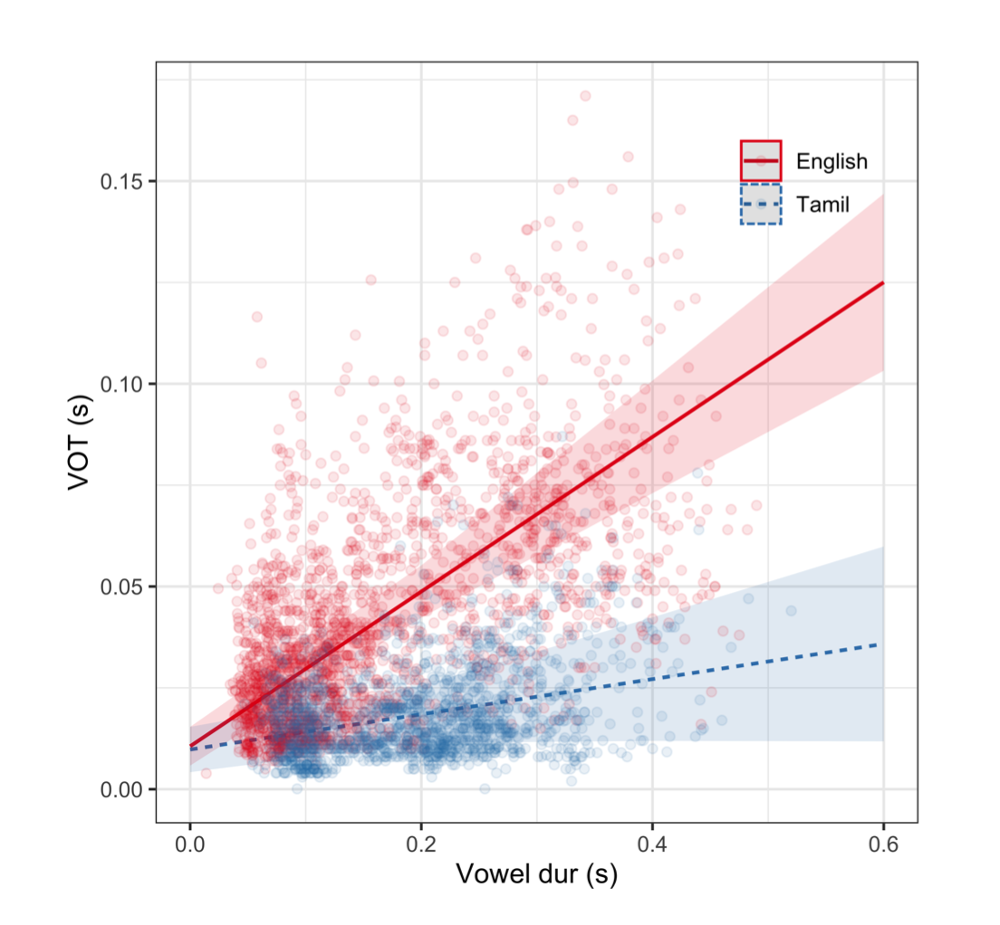

# **The Burst Voice project**

[SAP Lab](https://saplabyork.github.io)

### Background

This project follows from an earlier research project examining burst properties of oral voiceless consonants in prevocalic position (CV) as a function of speaking rate. In that project, we found that as people speak faster and faster, the bursts of their plosives decrease in amplitude. 

The reasoning is that as you speak faster there is less and less time for intraoral pressure to build up behind the constriction, so when the stop is released, the burst is more quiet than if there were more time (as in slower speech). I found this happening in both English (a language which contrasts voicing using short- and long-lag VOT) and Tamil (a language without phonological voicing in onset position and which only utilizes short lag VOT).

In the speaking rate research, the faster subjects spoke, the shorter their vowels in CVs. This was expected. So there is a correlation between pre-vocalic VOT and vowel duration. Take a look at this picture.

{width=50% height=50%}

So, pre-vocalic VOT is positively correlated with the duration of the following vowel. The question we are asking in the current research, is:

1. Is VOT likewise positively correlated with phonologically conditioned vowel duration? (Pt.1)
  In (most all) languages, the voicing of coda consonants is accompanied by longer vowel duration. So, the "a" in "pad" is longer than the "a" in "pat". Does this sort of vowel duration variation have a comparable effect on onset VOT and if so, does it conform to the pattern found with speaking rate conditioned vowel duration effects? My prediction here is that the effect will be real, but the *size* of the effect will be quite small (on the order of tens of ms).
  
2. If the question in (1) is positive, that is, speakers have longer VOT for "p" in "pad" than they do for the "p" in "pat", do listeners know/use this knowledge to inform their perception of the coda C voicing? This will be a perception test where listeners hear just the burst and first few cycles of the vowel of a CVC and guess what the final C is. For example, they will hear "pa-" and have to guess whether they heard "pat" or "pad".

### Gameplan

Part 1 of the project is acoustics. We will record 20 speakers of Canadian English (10 female, 10 male) in the Phonetics Studio (Ross S114). They will read this [word list](Burst_voice_reading_list.docx) twice. The list represent real word pairs like "pat"/"pad" for three places of articulation (p,t,k) and five lax vowels (I, E, U, c, ae), and three places of articulation in coda position (p,t,k). Not all combinations are represented, only real words.

Student members of the SAP Lab will assist in measuring:

1. **VOT**--Go through recording files, locate target words (correlate with the word list), identify and precisely locate onset VOTs on a text grid in Praat
2. **Vowel duration**--On another tier of the text grid, identify the onset and offset of the vowel in the target word
3. Run a Praat script (twice) on every recording file which will extract the durations of VOT and the Vowel.
4. Organize the output from the script into an Excel spreadsheet
